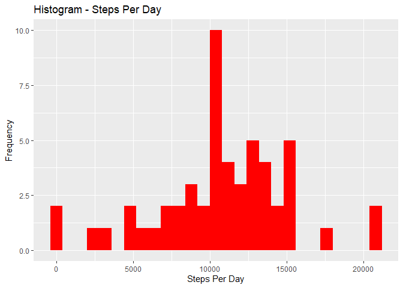
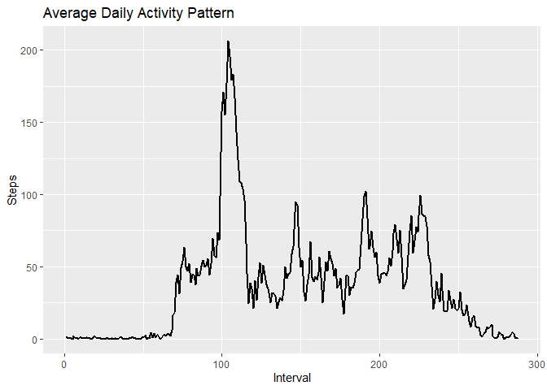
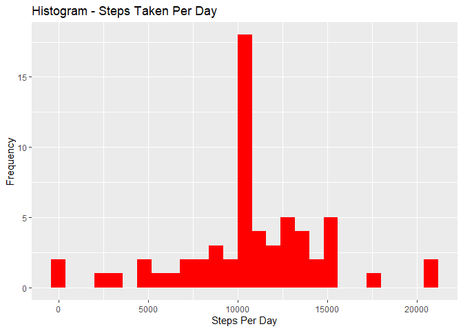
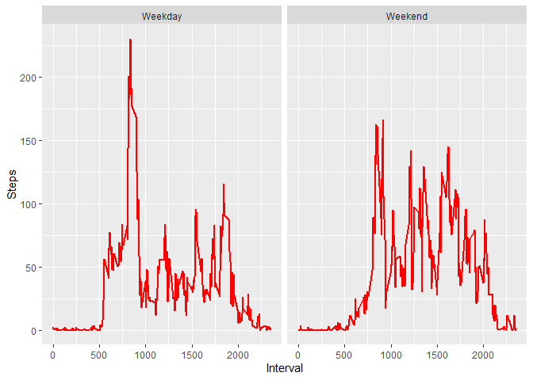

## Loading and preprocessing the data

## Load the data


```r
# unzip the zipped file 
activity <- unzip("activity.zip")

# load the data
act_data <- read.csv("activity.csv", header=TRUE, sep=",")
```

## Data preparation

Change the vectors form

```r
act_data$date <- as.Date(act_data$date, format = "%Y-%m-%d")
act_data$interval <- as.factor(act_data$interval)
```


## What is mean total number of steps taken per day?


## 1. Calculate the total number of steps taken per day

```r
steps_per_day <- act_data %>%
        group_by(date) %>%
        summarise(steps = sum(steps))

# Rename columns
colnames(steps_per_day) <- c("date", "steps")

# Remove NA rows
steps_per_day <- na.omit(steps_per_day)
```

## 2. Plot a histogram of the total number of steps per day

```r
ggplot(steps_per_day, aes(x = steps)) +
        geom_histogram(fill = "red", binwidth = 800) +
        labs(title = "Histogram - Steps Per Day", x = "Steps Per Day", y = "Frequency")
```

<!-- -->

## 3. Calculate and report the mean and median of the total number of steps taken per day

```r
mean_steps_per_day <- mean(steps_per_day$steps, na.rm = TRUE)

cat("The mean steps per day is: ", mean_steps_per_day, "and ")

median_steps_per_day <- median(steps_per_day$steps, na.rm = TRUE)

cat("the median steps per day is: ", median_steps_per_day)
```

```
## The mean steps per day is:  10766.19 and the median steps per day is:  10765
```


## What is the average daily activity pattern?


## 1. Make a time series plot (i.e. type = “l”) of the 5-minute interval (x-axis) and the average number of steps taken, averaged across all days (y-axis)


```r
steps_per_interval <- act_data %>%
        group_by(interval) %>%
        summarise(steps = mean(steps, na.rm = TRUE))

steps_per_interval$interval <- as.integer(steps_per_interval$interval)
```


### Plot the timeseries graph

```r
ggplot(steps_per_interval, aes(x = interval, y = steps)) + 
  geom_line(col = "black", size = 1) + 
  labs(title = "Average Daily Activity Pattern", x = "Interval", y = "Steps")
```

<!-- -->

## 2. Which 5-minute interval, on average across all the days in the dataset, contains the maximum number of steps?

```r
max_interval <- steps_per_interval[which.max(steps_per_interval$steps),]

max_interval
```

```
## # A tibble: 1 x 2
##   interval steps
##      <int> <dbl>
## 1      104  206.
```


# Inputing missing values


## 1. Calculate and report the total number of missing values in the dataset (i.e. the total number of rows with NAs)


```r
missing_values <- sum(is.na(act_data$steps))
missing_values
```

```
## [1] 2304
```

## 2. Devise a strategy for filling in all of the missing values in the dataset. The strategy does not need to be sophisticated. For example, you could use the mean/median for that day, or the mean for that 5-minute interval, etc.

To populate missing values, we choose to replace them with the mean value at the same interval across days


## 3. Create a new dataset that is equal to the original dataset but with the missing data filled in.


```r
new_act_data <- act_data
index_of_na <- which(is.na(new_act_data$steps))
for (i in index_of_na) {
  new_act_data$steps[i] <- with(steps_per_interval, steps[interval = new_act_data$interval[i]])
}
```
Print the top rows of newly created dataset

```r
head(new_act_data, 10)
```

```
##        steps       date interval
## 1  1.7169811 2012-10-01        0
## 2  0.3396226 2012-10-01        5
## 3  0.1320755 2012-10-01       10
## 4  0.1509434 2012-10-01       15
## 5  0.0754717 2012-10-01       20
## 6  2.0943396 2012-10-01       25
## 7  0.5283019 2012-10-01       30
## 8  0.8679245 2012-10-01       35
## 9  0.0000000 2012-10-01       40
## 10 1.4716981 2012-10-01       45
```

Given we have handled the missing values, let us check if the above strategy really worked out.


```r
new_missing_values <- sum(is.na(new_act_data$steps))
new_missing_values
```

```
## [1] 0
```


4. Make a histogram of the total number of steps taken each day and Calculate and report the mean and median total number of steps taken per day. Do these values differ from the estimates from the first part of the assignment? What is the impact of imputing missing data on the estimates of the total daily number of steps?


```r
new_steps_per_day <-
        aggregate(steps ~ date, data = new_act_data, FUN = sum)
colnames(new_steps_per_day) <- c("date", "steps")
ggplot(new_steps_per_day, aes(x = steps)) +
        geom_histogram(fill = "red", binwidth = 800) +
        labs(title = "Histogram - Steps Taken Per Day", x = "Steps Per Day", y = "Frequency")
```

<!-- -->


In order to find the impact of imputing the missing values, let us compute the mean and median of steps taken per day


```r
new_mean_steps_per_day <- mean(new_steps_per_day$steps)
new_mean_steps_per_day
new_median_steps_per_day <- median(new_steps_per_day$steps)
new_median_steps_per_day
```

```
## [1] 10766.19
## [1] 10766.19
```


## Are there differences in activity patterns between weekdays and weekends?

1. Create a new factor variable in the dataset with two levels - “weekday” and “weekend” indicating whether a given date is a weekday or weekend day.
Let us first add a factor variable to identify the given date as Weekday or Weekend


```r
dt <- data.table(new_act_data)
dt[, weekday := ifelse(weekdays(date) %in% c("Saturday", "Sunday"), "Weekend", "Weekday")]
dt$weekday <- as.factor(dt$weekday)
dt$interval <- as.integer(levels(dt$interval)[dt$interval])
```


```r
head(dt, 10)
```

```
##         steps       date interval weekday
##  1: 1.7169811 2012-10-01        0 Weekday
##  2: 0.3396226 2012-10-01        5 Weekday
##  3: 0.1320755 2012-10-01       10 Weekday
##  4: 0.1509434 2012-10-01       15 Weekday
##  5: 0.0754717 2012-10-01       20 Weekday
##  6: 2.0943396 2012-10-01       25 Weekday
##  7: 0.5283019 2012-10-01       30 Weekday
##  8: 0.8679245 2012-10-01       35 Weekday
##  9: 0.0000000 2012-10-01       40 Weekday
## 10: 1.4716981 2012-10-01       45 Weekday
```

2. Make a panel plot containing a time series plot (i.e. type = “l”) of the 5-minute interval (x-axis) and the average number of steps taken, averaged across all weekday days or weekend days (y-axis)


```r
steps_per_weekday <-
        aggregate(steps ~ interval + weekday, data = dt, FUN = mean)
ggplot(steps_per_weekday, aes(x = interval, y = steps)) +
        geom_line(col = "red", size = 1) +
        facet_wrap( ~ weekday, nrow = 1, ncol = 2) +
        labs(x = "Interval", y = "Steps")
```

<!-- -->

The patterns of the above graphs are not identical. The peak of the weakdays is higher than the pick of the weekend recordings. On the other hand the weekend recordings indicate more frequent picks than the recordings of the weekday.

